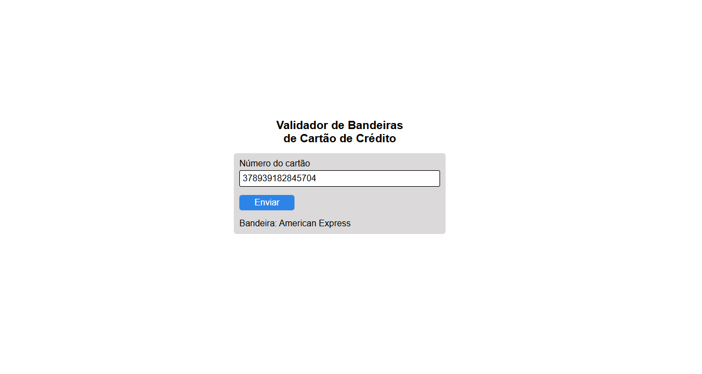
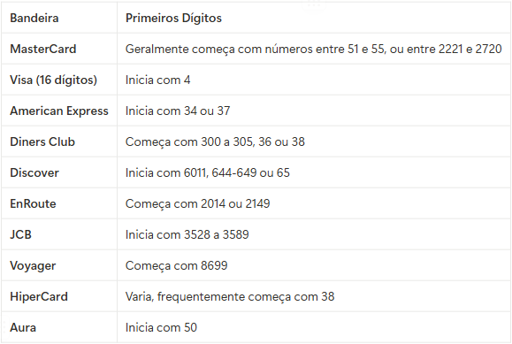

# Validador de Bandeiras de Cartão de Crédito

> Esta é uma aplicação simples desenvolvida como parte do desafio do **Bootcamp Microsoft 50 Anos - GitHub Copilot** da [DIO](https://www.dio.me/).

O objetivo do projeto era utilizar o GitHub Copilot para construir um validador que identifica a bandeira de um cartão de crédito com base nos seus dígitos iniciais.

## ✨ Como Funciona

O usuário digita o número do cartão de crédito no campo designado e clica no botão "Enviar". A aplicação então processa o número, identifica a bandeira correspondente usando expressões regulares e exibe o resultado na tela.

# 🤖 Prompts Utilizados na Criação

Aqui estão detalhados os prompts enviados para as IAs durante o desenvolvimento do projeto.

## 1° Prompt: Criação da tabela (Canva AI)

-   **Ferramenta:** Canva AI
-   **Objetivo:** Criação visual de uma tabela contendo as bandeiras e sua especificações.
-   **Prompt enviado:**
    > Crie uma tabela com duas colunas.  
    > Na primeira coluna as seguintes bandeiras de cartões de créditos: MasterCard, Visa (16 dígitos), American Express, Diners Club, Discover, EnRoute, JBC, Voyager, HiperCard, Aura.  
    > Na segunda coluna: os primeiros dígitos que cada uma delas começa e que indicam a bandeira a que ele pertence.  
    > Exemplo:  
    > | MasterCard | Geralmente começa com números entre 51 e 55, ou entre 2221 e 2720 |  
    > | American Express | Inicia com 34 ou 37 |
-   **Resposta da IA:** A IA gerou a imagem a seguir, contendo uma tabela com os dados solicitados. Esta imagem serviu como base para criar a lógica de validação no JavaScript.
    
    

## 2° Prompt: Lógica de Validação (Microsoft Copilot no VS Code)

-   **Ferramenta:** Microsoft Copilot no Visual Studio Code
-   **Contexto:** O esqueleto do projeto (arquivos `index.html` e `style.css`) já estava criado.
-   **Objetivo:** Gerar todo o código JavaScript necessário para implementar a lógica de detecção da bandeira do cartão, com base nos padrões da tabela.
-   **Prompt enviado:**  
    > Crie uma função, em index.js, para validar o número do cartão de crédito inserido pelo usuário com base na imagem "tabela-bandeiras.png". Ao validar a bandeira, insira o nome dela em #resultado, por exemplo "Bandeira: Mastercard”.
-   **Resposta da IA:** O Copilot gerou a função `detectarBandeira` e o `event listener` para o formulário, resultando no código completo que está no arquivo `index.js`.
